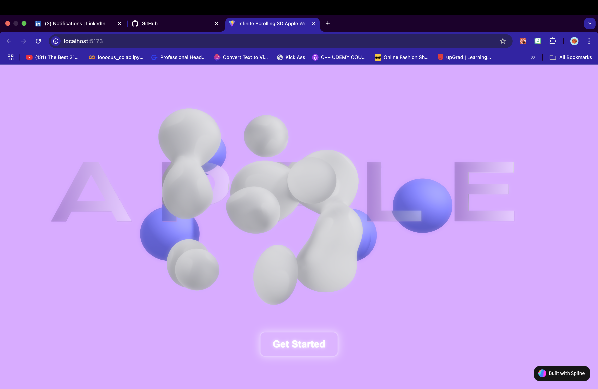
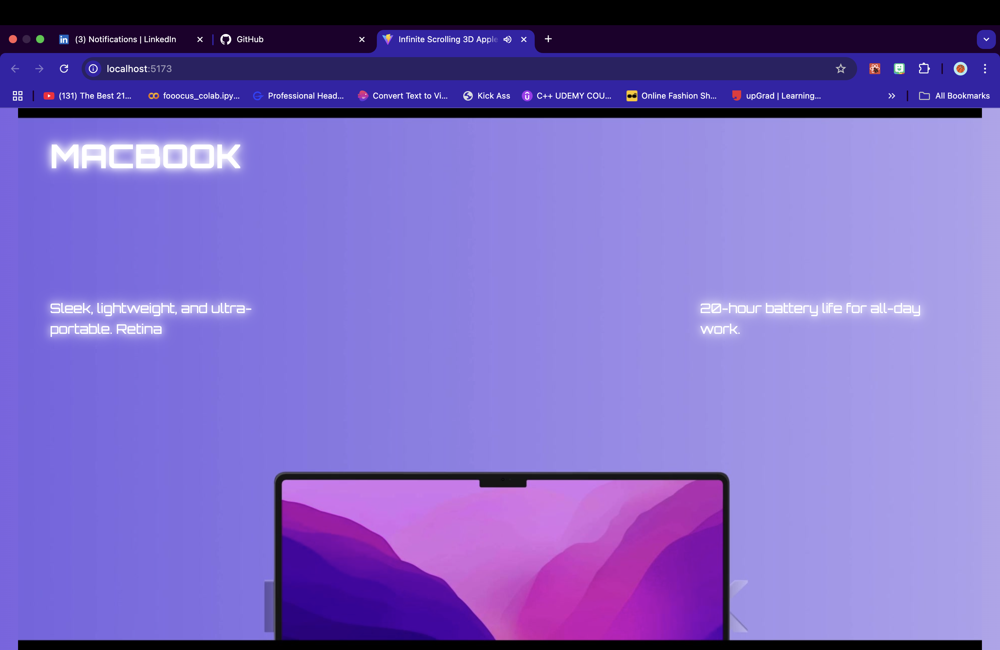
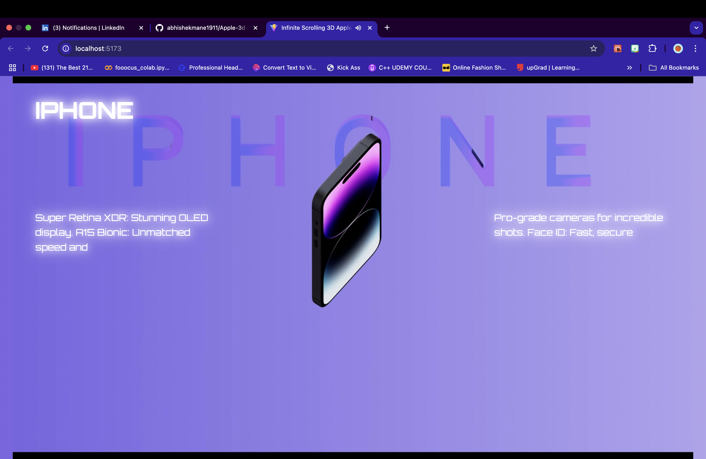
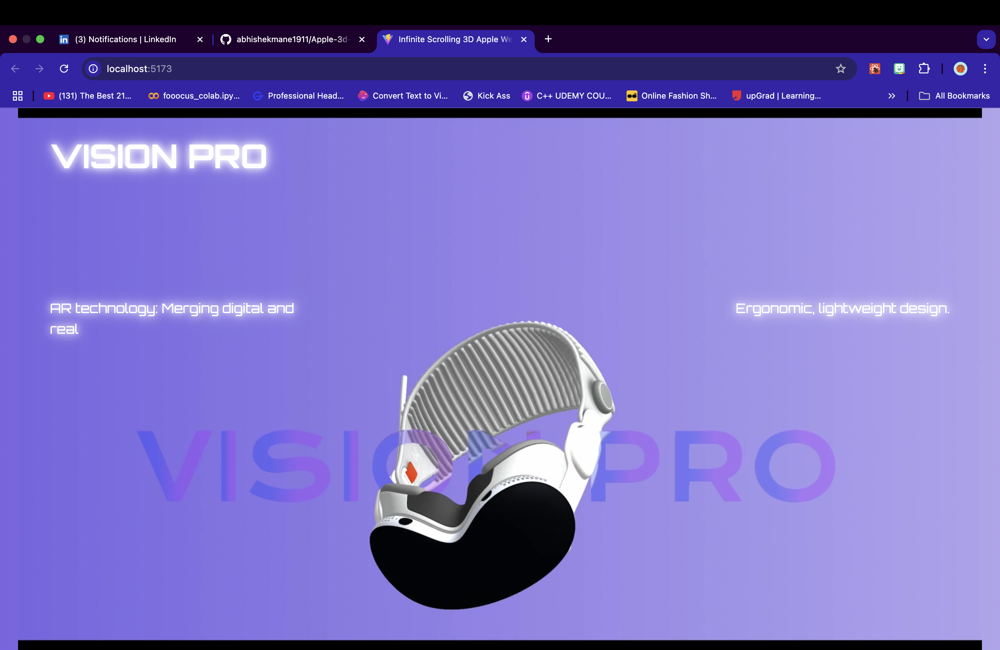

# Apple 3D Website

## Overview

This is a visually stunning and interactive website showcasing Apple products using 3D animations and effects. The website begins with an engaging "3d Build" element that, upon interaction, reveals a showcase of various Apple products. The site combines modern web technologies, including React, Framer Motion, Howl, and Spline to deliver a smooth, immersive user experience.

## Features

### 1. **Interactive Landing Page**

- The website starts with a 3D element that grabs the user's attention.
- Clicking on the element transitions the user to the Apple product showcase.

### 2. **Apple Product Showcase**

- Features a collection of Apple products displayed with interactive animations.
- Smooth scroll effects and dynamic transitions enhance the user experience.

### 3. **Modern UI/UX**

- Frosted glass effect on elements for a sleek design.
- Responsive layout ensures the website looks great on all devices.

### 4. **Performance Optimizations**

- Assets are optimized for fast loading.
- Lazy loading ensures smooth performance even on low-end devices.

## Tech Stack

- **React**: Frontend framework for building interactive components.
- **Framer Motion**: For smooth animations and transitions.
- **Spline** : Used to create 3d animations
- **Howl** : For sound effects
## Installation and Setup

### Prerequisites

- React.js 
- npm or yarn

### Steps

1. Clone the repository:
   ```bash
   git clone https://github.com/abhishekmane1911/apple-3d-website.git
   cd apple-3d-website
   ```
2. Install dependencies:
   ```bash
   npm install
   # or
   yarn install
   ```
3. Start the development server:
   ```bash
   npm start
   # or
   yarn start
   ```
4. Open your browser and navigate to `http://localhost:5173`.

### Building for Production

To create a production-ready build:

```bash
npm run build
# or
yarn build
```

The output will be available in the `build` folder.

## Deployment

The website is hosted on Vercel. To deploy:

1. Push your code to a GitHub repository.
2. Link your repository to Vercel.
3. Vercel will automatically build and deploy your site.

## Live Demo

[Click here to view the live demo](https://abhishekmane1911.github.io/apple-3d-website)

## Screenshots

### 1. **Landing Page**



### 2. **Product Showcase**





## Folder Structure

```
apple-3d-website/
|-- public/             # Static assets
|   |-- webimages/      # Background images
|-- src/                # Source code
|   |-- components/     # Reusable components
|        |-- Elements.tsx
|        |-- Loading.tsx
|        |-- ScrollableTextCanvas.tsx
|        |-- ScrollableTextCanvas.css
|        |-- TextOverlay.tsx
|        |-- TextOverlay.css
|        |-- Loading.css
|        |-- LandingScene.tsx        
|   |-- App.tsx         # Main application file
|   |-- App.css
|   |-- main.tsx
|-- package.json        # Project metadata and dependencies
```

## Known Issues

- None currently.

## Contributions

Contributions are welcome! Feel free to fork the repository and submit a pull request.

## License

This project is licensed under the MIT License.

---

Created by [Abhishek Mane](https://github.com/abhishekmane1911).

